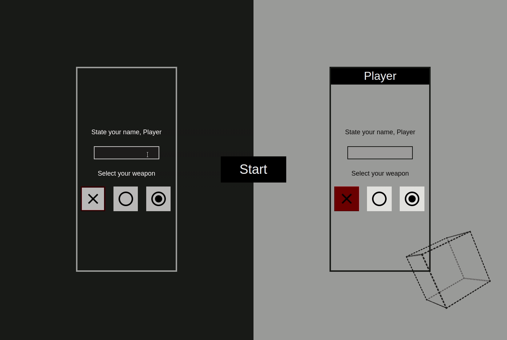

# TicTacToe

> Simple TicTacToe Game using JavaScript Module Pattern and Factory Functions. A MiniMax Algorithm was applied for machine response in the game.



Let's play a game. This TicTacToe game brings back childhood in a virtual manner. Play with a friend by taking turns or dare the machine to see if you can win (Spoiler: You can't. Don't believe me? Try!

## Built With

- HTML/CSS, JavaScript
- Visual Studio Code

## Live Demo

[Live Demo Link](https://johnftitor.github.io/ticTacToe/)


## Getting Started

To get a local copy up and running follow these simple example steps.

- Clone this repository with git clone```https://github.com/JohnFTitor/ticTacToe.git``` using your terminal or command line.
- Change to the project directory by entering : <br>
```cd ticTacToe``` in the terminal

### Setup

You can clone this repository or simply download the files as a .zip
If you want to set up a personal repository based on this one, you can as well fork it.

### Usage

You're free to use this project however you like it for educational purposes. Just keep in mind the acknowledgment described below

### Deployment

The deployment can be found in the Github Pages of this repository or through the link provided above

## Authors

👤 **Andrés Felipe Arroyave Naranjo**

- GitHub: [@JohnFTitor](https://github.com/JohnFTitor)
- Twitter: [@johnftitor](https://twitter.com/johnftitor)
- LinkedIn: [Andres](https://www.linkedin.com/in/andresfelipe117/?locale=en_US)

## Show your support

Give a ⭐️ if you like this project!
